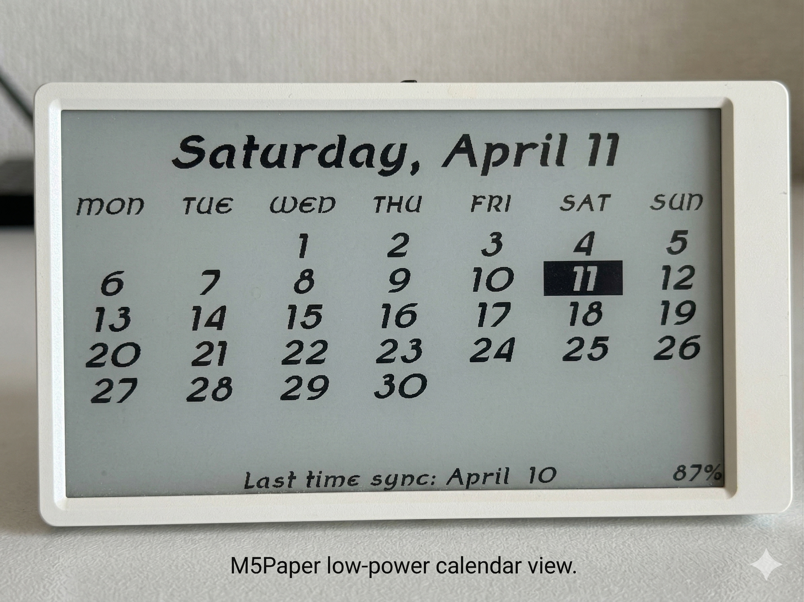

# M5Paper Low-Power Calendar Dashboard

[](https://github.com/konakira/M5EPDCalendar/actions)



A highly efficient, minimalist calendar dashboard for the M5Stack M5Paper (M5EPD), featuring deep-sleep technology and customizable week-start options.

## Features

- **Extreme Battery Life**: Designed to last for months on a single charge by utilizing full system shutdown between updates.
- **Customizable Week Layout**: Monday-start (default) and Sunday-start supported via build flags.
- **Auto-Sync**: Synchronizes time via NTP every 30 days to ensure accuracy.
- **Battery Monitoring**: Built-in battery percentage display with optimized voltage-to-capacity mapping.

## Why the Battery Lasts So Long

This project is optimized for "Deep-Sleep-and-Forget" usage. The longevity is achieved through three technical pillars:

1. **True Power-Off (RTC Wakeup)**: Instead of a standard software "light sleep," the device uses `M5.shutdown()`. This cuts power to the ESP32 almost entirely. The BM8563 Real-Time Clock (RTC) remains the only component drawing a tiny amount of current to trigger a reboot at midnight.
2. **Electronic Paper Display (e-Ink)**: The 4.7" e-Ink display requires zero power to maintain an image. Once the calendar is drawn, the device turns off, and the image stays on the screen indefinitely.
3. **Daily Duty Cycle**: The device only wakes up once every 24 hours for a few seconds to update the date. It stays in a total power-off state for 99.9% of the time.

## Setup

This project uses **PlatformIO**. By default, the calendar is built with a **Monday-start** layout.

### 1. Wi-Fi Configuration
Copy the provided `auth.h.example` file and rename it to `auth.h`. Open `auth.h` and enter your W-Fi credentials. 

### 2. Font File (Required)
This project requires a TrueType Font (TTF) file to display the calendar.
1. Download a TTF font of your choice.
2. Rename the file to **`font.ttf`**.
3. Place it in the **root directory** of your SD card.

#### Where to get free fonts?
You can find high-quality, free-to-use TrueType fonts at:
- [Google Fonts](https://fonts.google.com/) (Recommended: Roboto, Open Sans, or Lato)
- [1001 Free Fonts](https://www.1001freefonts.com/)

### 3. Build and Flash
Insert the SD card into your M5Paper, then build and upload the project using PlatformIO.

This project uses **PlatformIO** (typically via the VS Code extension). The `platformio.ini` is pre-configured with two environments so you can easily switch between Monday-start and Sunday-start without modifying the source code.
 
### `platformio.ini` Configuration
 ```ini
[env:m5stack-monday]
 platform = espressif32
 board = m5stack-fire
 framework = arduino
; No extra flags needed for Monday-start (Default)
 
[env:m5stack-sunday]
 platform = espressif32
 board = m5stack-fire
 framework = arduino
 build_flags = 
     -D SUNDAY_START


